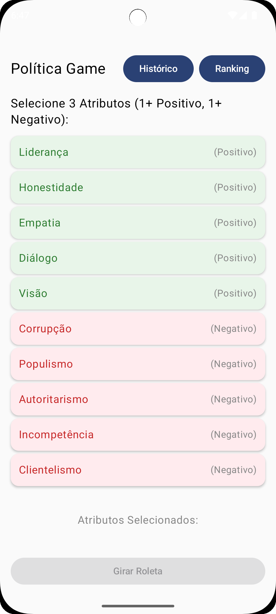
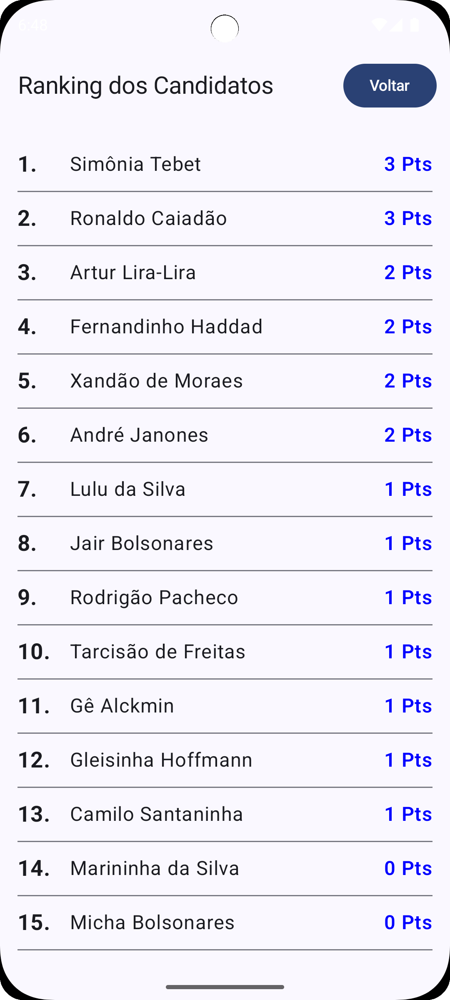
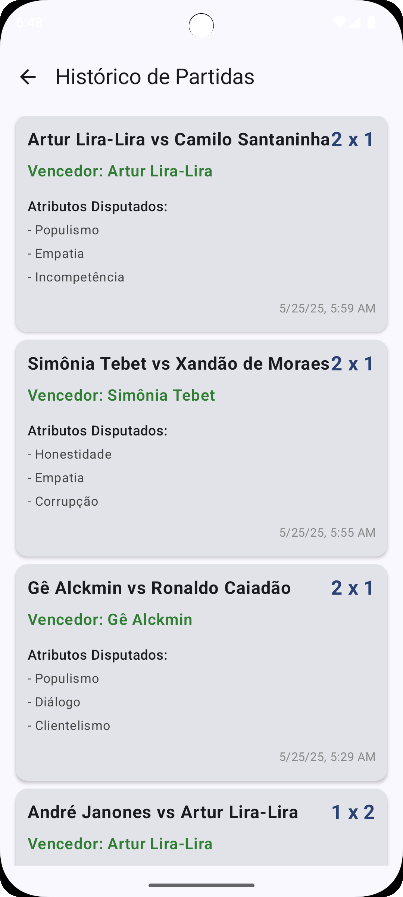

# Política Game 🎲🇧🇷

Um divertido jogo mobile de batalha política baseado em atributos! Escolha seus trunfos, gire a roleta e veja quem vence a disputa no cenário político (com uma boa dose de humor).

## 🎮 Sobre o Jogo

Política Game é um aplicativo Android que simula confrontos entre figuras políticas brasileiras (apresentadas com nomes engraçados e descaracterizados). O jogador seleciona 3 atributos - sendo pelo menos um positivo e um negativo - que serão seus critérios de batalha. Em seguida, a "roleta política" seleciona aleatoriamente um candidato para representar o jogador.

Ao clicar em "Jogar!", o sistema escolhe um oponente aleatório e compara os 3 atributos selecionados:

* **Atributos Positivos:** Ganha ponto quem tiver o MAIOR valor.
* **Atributos Negativos:** Ganha ponto quem tiver o MENOR valor.

O candidato que marcar 2 ou mais pontos vence a partida e ganha pontos no ranking geral!

## ✨ Funcionalidades

* **Seleção de Atributos:** Escolha 3 atributos estratégicos para o confronto.
* **Roleta de Candidatos:** Descubra qual político (com nome engraçado) você irá representar.
* **Batalha de Atributos:** Confronto automático baseado nos valores (randomizados) de cada candidato.
* **Sistema de Pontuação:** Lógica clara para definir o vencedor de cada partida.
* **Ranking Geral:** Acompanhe a pontuação acumulada de cada candidato.
* **Histórico de Partidas:** Veja os resultados dos últimos confrontos.
* **Navegação Simples:** Alterne facilmente entre as telas de Jogo, Ranking e Histórico.

## 💻 Tecnologias Utilizadas

* **Linguagem:** [Kotlin](https://kotlinlang.org/)
* **UI Toolkit:** [Jetpack Compose](https://developer.android.com/jetpack/compose)
* **Banco de Dados:** [SQLite](https://www.sqlite.org/index.html) (Gerenciado via `SQLiteOpenHelper` nativo do Android)
* **Arquitetura:** Baseada em Repositório simples e gerenciamento de estado no `Composable`.
* **Versionamento:** [Git](https://git-scm.com/)

## 📸 Telas (Exemplos)

|               Tela de Jogo               |             Tela de Ranking              |            Tela de Histórico             |
|:----------------------------------------:|:----------------------------------------:|:----------------------------------------:|
| ** | ** | ** |

## ⚙️ Como Executar o Projeto

1.  **Clone o Repositório:**
    ```bash
    git clone https://github.com/pablocuca/pucpr-politica_game
    ```
2.  **Abra no Android Studio:**
    * Inicie o Android Studio.
    * Selecione "Open an existing project".
    * Navegue até a pasta onde você clonou o projeto e selecione-a.
3.  **Aguarde a Sincronização:** O Android Studio irá baixar as dependências (Gradle sync).
4.  **Execute:**
    * Conecte um dispositivo Android ou inicie um Emulador.
    * Clique no botão "Run 'app'" (ícone de play verde).

## 🚀 Próximos Passos (Sugestões)

* Polimento da Interface (UI/UX).
* Adicionar mais candidatos e atributos.
* Implementar `Scaffold` em todas as telas para padronização.
* Adicionar ícones e/ou imagens para os candidatos.
* Melhorar o sistema de navegação (ex: Jetpack Navigation).
* Adicionar sons e animações.

## 📄 Licença

---